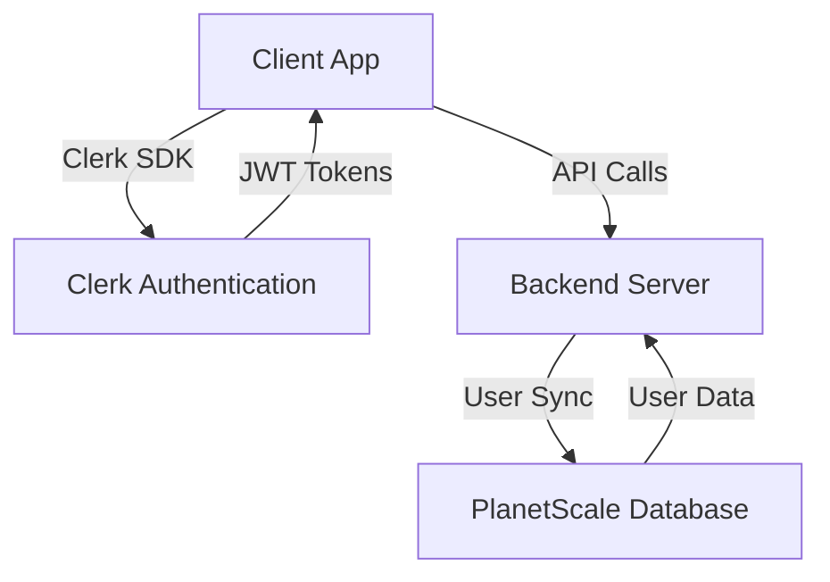
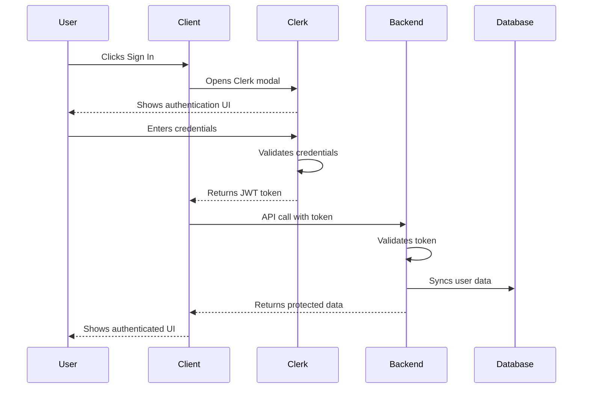
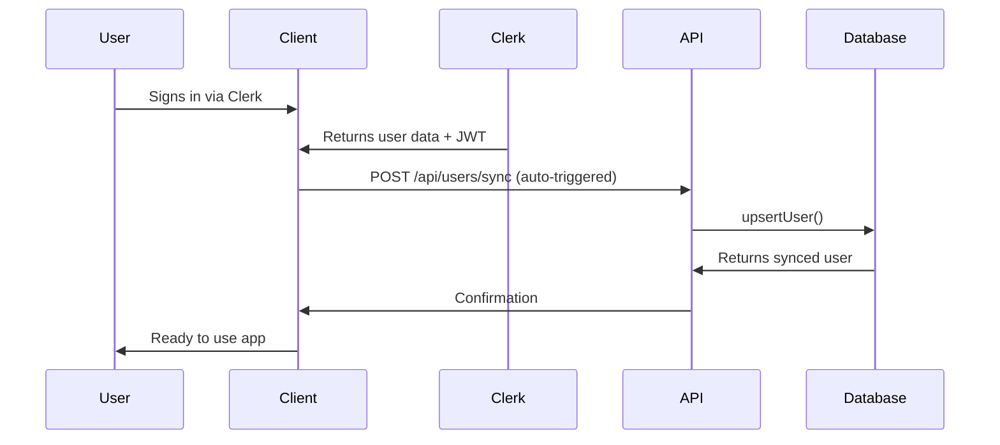

# Clerk Authentication Setup & Verification

## 🎯 Authentication Architecture



## 🔐 Setup Checklist

### 1. Clerk Dashboard Configuration

#### Create Clerk Application
1. Go to [Clerk Dashboard](https://dashboard.clerk.com/)
2. Create a new application
3. Select "React" as the framework
4. Copy your **Publishable Key** and **Secret Key**

#### Configure Application Settings
- **Application Name**: Carolers
- **Domain**: Your production domain (e.g., `carolers.app`)
- **Development Origins**: `http://localhost:5000`
- **Redirect URLs**: 
  - `http://localhost:5000`
  - `http://localhost:5000/*`
  - Your production URL

#### Enable Required Features
- **User Profiles**: Enable
- **Email Addresses**: Required
- **Username**: Optional
- **Image Uploads**: Enable

### 2. Environment Variables

Create/update `.env.local` in the `client` directory:

```env
# Clerk Configuration
VITE_CLERK_PUBLISHABLE_KEY=pk_test_your-publishable-key-here

# For backend (create .env in root if needed)
CLERK_SECRET_KEY=sk_test_your-secret-key-here
```

### 3. Install Required Packages

```bash
# Frontend dependencies
npm install @clerk/clerk-react

# Backend dependencies (if needed for webhooks)
npm install @clerk/clerk-sdk-node
```

## ✅ Verification Steps

### Frontend Authentication Verification

#### 1. Check Clerk Provider Setup

**File**: `client/src/main.tsx`

```jsx
<ClerkProvider publishableKey={clerkPK}>
  <RouterProvider router={router} />
</ClerkProvider>
```

✅ **Verification**: The app should be wrapped in `ClerkProvider`

#### 2. Verify Auth Hook

**File**: `client/src/lib/auth.ts`

```typescript
export function useAppUser(): { 
  user: AppUser | null; 
  isLoading: boolean;
  signOut: () => Promise<void>;
}
```

✅ **Verification**: Hook should return user data, loading state, and signOut function

#### 3. Check Navigation Integration

**File**: `client/src/components/Nav.tsx`

```jsx
const { user, isLoading } = useAppUser();

{isLoading ? (
  <div className="w-8 h-8 bg-gray-200 rounded-full animate-pulse" />
) : user ? (
  <UserButton />
) : (
  <SignInButton mode="modal">...</SignInButton>
)}
```

✅ **Verification**: Should show loading state, then UserButton or SignInButton

### 4. Test Authentication Flow

#### Sign Up Test
1. Click "Sign Up" button in navigation
2. Fill out the Clerk sign-up form
3. Verify email if required
4. ✅ Should redirect back to app with user authenticated

#### Sign In Test
1. Click "Sign In" button in navigation
2. Enter credentials
3. ✅ Should show UserButton with user avatar

#### Sign Out Test
1. Click on UserButton dropdown
2. Click "Sign Out"
3. ✅ Should return to unauthenticated state

### Backend Verification (Optional)

If implementing Clerk webhooks for user synchronization:

#### 1. Set Up Webhook Endpoint

**File**: `server/routes.ts` (add webhook route)

```typescript
// Clerk Webhook for user synchronization
app.post('/api/webhooks/clerk', express.raw({type: 'application/json'}), async (req, res) => {
  const payload = req.body;
  const signature = req.headers['svix-signature'];
  
  try {
    const wh = new Webhook(CLERK_WEBHOOK_SECRET);
    const evt = wh.verify(payload, signature) as ClerkEvent;
    
    // Handle user events
    switch (evt.type) {
      case 'user.created':
      case 'user.updated':
        await syncClerkUser(evt.data);
        break;
      // ... other event types
    }
    
    res.status(200).json({ success: true });
  } catch (err) {
    console.error('Clerk webhook error:', err);
    res.status(400).json({ error: 'Invalid webhook' });
  }
});
```

#### 2. Configure Clerk Webhook

1. Go to Clerk Dashboard → Webhooks
2. Add new webhook
3. **Endpoint URL**: `https://yourdomain.com/api/webhooks/clerk`
4. **Events to send**:
   - `user.created`
   - `user.updated`
   - `user.deleted`
5. Copy **Signing Secret** to environment variables

## 🔧 Troubleshooting

### Common Issues & Solutions

#### Issue: "Missing Clerk Publishable Key"

**Error**: `Error: Missing Clerk Publishable Key`

**Solution**:
1. Check `.env.local` file exists in `client` directory
2. Verify `VITE_CLERK_PUBLISHABLE_KEY` is set
3. Restart development server

#### Issue: Authentication Not Persisting

**Symptoms**: User signs in but shows as unauthenticated on page refresh

**Solution**:
1. Check Clerk Provider is at root of app
2. Verify no duplicate ClerkProvider wrappers
3. Ensure proper domain configuration in Clerk dashboard

#### Issue: Sign-In Button Not Working

**Symptoms**: Clicking sign-in button does nothing

**Solution**:
1. Check Clerk script is loaded
2. Verify publishable key is correct
3. Ensure no JavaScript errors in console

#### Issue: User Data Not Available

**Symptoms**: `useAppUser()` returns null when user is signed in

**Solution**:
1. Check `isLoading` state
2. Verify Clerk hooks are used within ClerkProvider
3. Ensure no ad blockers interfering with Clerk

## 🛡️ Security Best Practices

### Frontend Security

1. **Never expose secret keys** in client-side code
2. **Use VITE_ prefix** for environment variables
3. **Validate all user input** before sending to backend
4. **Use HTTPS** in production

### Backend Security

1. **Verify Clerk JWT tokens** on protected API routes
2. **Use Clerk webhooks** for critical user operations
3. **Implement rate limiting** on auth endpoints
4. **Store sensitive data** securely

## 📊 Authentication Flow



## 🎯 User Data Synchronization

### 🚀 Automatic Synchronization System

The application now includes a **complete user synchronization system** that automatically syncs Clerk users to PlanetScale database.

#### Architecture



### 🔧 Implementation Components

#### 1. Backend Services

**User Sync Service** (`server/services/userSync.ts`):
- Handles Clerk → PlanetScale user synchronization
- Automatic username generation
- Batch synchronization support
- Sync status checking

**API Endpoints** (`server/routes/userRoutes.ts`):
- `POST /api/users/sync` - Sync user data
- `GET /api/users/:userId` - Get user by Clerk ID
- `GET /api/users/:userId/needs-sync` - Check sync status

#### 2. Frontend Hooks

**Auto-Sync Hook** (`client/src/hooks/useUserSync.ts`):
- Automatically syncs users on authentication
- Checks sync status before syncing
- Handles errors gracefully

**Manual Sync Hook** (`client/src/hooks/useManualUserSync.ts`):
- Provides manual sync functionality
- Useful for testing and troubleshooting

### 🔄 Synchronization Flow

1. **User signs in** via Clerk components
2. **useAppUser() hook** provides user data
3. **useUserSync() hook** detects new/changed user
4. **Auto-sync triggered** (with 1s delay to avoid race conditions)
5. **API call** to `/api/users/sync` with user data
6. **Database upsert** creates or updates user
7. **User ready** for full app functionality

### 📋 User Data Mapping

| Clerk Field | Database Field | Notes |
|-------------|----------------|-------|
| `id` | `id` | Clerk user ID (primary key) |
| `username` | `username` | Direct mapping |
| `fullName` | `username` | Fallback if no username |
| `primaryEmailAddress.emailAddress` | `email` | User email |
| `imageUrl` | `imageUrl` | Profile picture |

### 🧪 Testing the Synchronization

#### Manual Testing

1. **Sign up** with a new Clerk account
2. **Check browser console** for sync confirmation
3. **Verify database** has the new user record
4. **Sign out and back in** to test persistence

#### API Testing

```bash
# Test user sync endpoint
curl -X POST http://localhost:5000/api/users/sync \
  -H "Content-Type: application/json" \
  -d '{
    "userId": "test_user_123",
    "username": "test_user",
    "email": "test@example.com",
    "imageUrl": "https://example.com/avatar.jpg"
  }'

# Check if user needs sync
curl http://localhost:5000/api/users/test_user_123/needs-sync

# Get user data
curl http://localhost:5000/api/users/test_user_123
```

### ⚙️ Configuration

No additional configuration needed! The system works automatically:

- **Auto-sync**: Enabled by default via `useUserSync` hook
- **Error handling**: Automatic retries and error logging
- **Performance**: Delayed sync to avoid race conditions

### 🔒 Security Considerations

1. **User ID validation**: Only Clerk-generated IDs accepted
2. **Data sanitization**: Username generation removes special chars
3. **Error handling**: Failures logged but don't break user experience
4. **Rate limiting**: Built-in delay prevents rapid-fire syncs

### 📊 Monitoring

Check server logs for synchronization events:

```bash
# Look for sync events
grep "user-sync" server.log

# Successful sync
🔄 User synchronized: user_2Fk1... (john_doe)

# Failed sync
❌ User sync failed for user_2Fk1...: Error details
```

### 🛠 Troubleshooting

#### Issue: User not synchronized

**Symptoms**: User can authenticate but data not in database

**Solutions**:
1. Check browser console for sync errors
2. Test API endpoint manually (see above)
3. Verify database connection
4. Check server logs for errors

#### Issue: Duplicate users

**Symptoms**: Multiple records for same Clerk ID

**Solutions**:
1. The `upsertUser` method prevents duplicates
2. If found, check for manual database modifications
3. Use Clerk ID as primary key to enforce uniqueness

#### Issue: Sync conflicts

**Symptoms**: Race conditions during sync

**Solutions**:
1. Built-in 1s delay helps prevent conflicts
2. Database transactions ensure atomicity
3. Check for network connectivity issues

### 🎯 Production Readiness

The synchronization system is production-ready with:

- ✅ **Automatic operation** - No manual intervention needed
- ✅ **Error resilience** - Failures don't break authentication
- ✅ **Performance optimized** - Minimal impact on user experience
- ✅ **Scalable** - Handles concurrent user sign-ups
- ✅ **Monitored** - Comprehensive logging for troubleshooting

### 🚀 Next Steps

1. **Test with real users** - Verify end-to-end flow
2. **Monitor sync success rate** - Track in analytics
3. **Consider webhooks** - For real-time sync (advanced)
4. **Add sync status UI** - Visual feedback for users

## 🚀 Next Steps

### Production Readiness

1. **Set up production Clerk application**
2. **Configure production domain**
3. **Set up Clerk webhooks** for automatic user sync
4. **Implement token validation** on backend routes
5. **Test authentication flow** thoroughly

### Advanced Features

1. **Social login** (Google, Apple, etc.)
2. **Passwordless authentication**
3. **Multi-factor authentication**
4. **Organization support** for group events
5. **Custom user profiles** with caroling preferences

## 📚 Resources

- [Clerk Documentation](https://clerk.com/docs)
- [Clerk React SDK](https://clerk.com/docs/quickstarts/react)
- [Clerk Webhooks](https://clerk.com/docs/webhooks/overview)
- [JWT Validation Guide](https://clerk.com/docs/references/backend/jwt-validation)